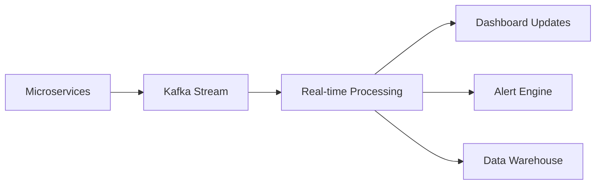

# Boeing Airline Ticketing System - Admin Dashboard Specification

## Table of Contents
1. [Executive Summary](#executive-summary)
2. [Dashboard Architecture](#dashboard-architecture)
3. [Core Dashboard Modules](#core-dashboard-modules)
4. [Key Performance Indicators (KPIs)](#key-performance-indicators-kpis)
5. [Data Sources and Metrics](#data-sources-and-metrics)
6. [Real-time Monitoring Requirements](#real-time-monitoring-requirements)
7. [Visualization Components](#visualization-components)
8. [Alert and Notification System](#alert-and-notification-system)
9. [Technical Implementation](#technical-implementation)
10. [Security and Access Control](#security-and-access-control)

---

## Executive Summary

The Boeing Airline Ticketing System Admin Dashboard provides comprehensive monitoring, analytics, and management capabilities for airline operations. This specification outlines the complete dashboard requirements, including real-time monitoring, business intelligence, operational efficiency tracking, and financial analytics.

### Dashboard Objectives
- **Operational Excellence**: Monitor flight operations, aircraft utilization, and service quality
- **Financial Performance**: Track revenue, costs, and profitability across all operations
- **Customer Experience**: Analyze booking patterns, satisfaction, and loyalty engagement
- **System Performance**: Monitor technical metrics and system health
- **Business Intelligence**: Provide actionable insights for strategic decision making

---

## Dashboard Architecture

### Multi-Level Dashboard Structure

#### 1. Executive Dashboard (C-Level)
- **Target Users**: CEO, COO, CFO, VP Operations
- **Update Frequency**: Real-time key metrics, hourly summaries
- **Focus**: High-level KPIs, trends, and strategic insights

#### 2. Operations Management Dashboard
- **Target Users**: Operations Manager, Fleet Manager, Route Planners
- **Update Frequency**: Real-time operational data, 5-minute intervals
- **Focus**: Flight operations, aircraft management, route performance

#### 3. Financial Analytics Dashboard
- **Target Users**: Finance Manager, Revenue Manager, Accounting
- **Update Frequency**: Real-time payment data, daily financial summaries
- **Focus**: Revenue tracking, cost analysis, financial forecasting

#### 4. Customer Experience Dashboard
- **Target Users**: Customer Service Manager, Marketing Manager
- **Update Frequency**: Real-time customer interactions, hourly analytics
- **Focus**: Booking experience, satisfaction metrics, loyalty programs

#### 5. System Performance Dashboard
- **Target Users**: IT Manager, System Administrator, DevOps
- **Update Frequency**: Real-time system metrics, continuous monitoring
- **Focus**: Technical performance, security monitoring, system health

---

## Core Dashboard Modules

### 1. Executive Overview Module

#### Key Metrics Display
```
📊 Daily Revenue: $2,450,000 (+12% vs yesterday)
✈️ Flights Completed: 847/850 (99.6%)
👥 Passengers Served: 125,340 (+8% vs last week)
📈 Load Factor: 87.3% (↑ 2.1% vs last month)
⭐ Customer Satisfaction: 4.6/5.0 (↑ 0.2 vs last month)
🎯 On-Time Performance: 94.2% (↑ 1.8% vs last month)
```

#### Executive KPI Cards
- **Revenue Performance**: Daily, weekly, monthly revenue with growth rates
- **Operational Efficiency**: Flight completion rates, on-time performance
- **Customer Metrics**: Satisfaction scores, loyalty engagement, NPS
- **Market Position**: Market share, competitive analysis, route performance

### 2. Operations Management Module

#### Flight Operations Board
```
🛫 Active Flights: 156 flights in progress
⏰ Delayed Flights: 12 flights (7.7% of total)
❌ Cancelled Flights: 2 flights (1.3% of total)
🔧 Maintenance Alerts: 3 aircraft scheduled
⛽ Fuel Consumption: 89,450 gallons today
🌤️ Weather Delays: 5 flights affected
```

#### Aircraft Management
```
📋 Fleet Status:
- Boeing 737: 45 active, 3 maintenance, 2 grounded
- Airbus A320: 38 active, 1 maintenance, 1 grounded
- Boeing 787: 12 active, 1 maintenance, 0 grounded

🔧 Maintenance Schedule:
- Today: 6 aircraft scheduled
- This Week: 23 aircraft scheduled
- Next 30 Days: 78 aircraft scheduled
```

#### Route Performance Analytics
```
🗺️ Top Performing Routes (by Revenue):
1. JFK → LAX: $145,000 (92% load factor)
2. ORD → SFO: $128,000 (89% load factor)
3. MIA → JFK: $112,000 (85% load factor)

📉 Underperforming Routes:
1. DEN → SEA: $45,000 (67% load factor)
2. ATL → BOS: $52,000 (71% load factor)
```

### 3. Financial Analytics Module

#### Revenue Tracking
```
💰 Today's Revenue: $2,450,000
📊 Monthly Revenue: $68,750,000 (Target: $70,000,000)
📈 YTD Revenue: $825,000,000 (+15% YoY)
💳 Payment Success Rate: 98.7%
🔄 Refund Rate: 2.3%
```

#### Revenue by Service Type
```
🎫 Ticket Sales: $2,100,000 (85.7%)
🧳 Baggage Fees: $245,000 (10.0%)
🍽️ In-flight Services: $70,000 (2.9%)
🎁 Loyalty Redemptions: $35,000 (1.4%)
```

#### Payment Processing Metrics
```
💳 Payment Methods:
- Credit Cards: 78.5%
- VNPay: 15.2%
- Bank Transfer: 4.8%
- Other: 1.5%

⚡ Processing Times:
- Average: 2.3 seconds
- 95th Percentile: 4.7 seconds
- Success Rate: 98.7%
```

### 4. Customer Experience Module

#### Booking Funnel Analysis
```
🔍 Flight Search: 45,670 searches
👀 Flight Selection: 23,890 selections (52.3%)
👤 Passenger Info: 18,450 completions (77.2%)
💳 Payment: 16,780 payments (91.0%)
✅ Confirmation: 16,234 bookings (96.7%)

Overall Conversion Rate: 35.5%
```

#### Customer Satisfaction Metrics
```
⭐ Overall Rating: 4.6/5.0
📝 Reviews This Month: 8,945
😊 Positive Feedback: 85.2%
😐 Neutral Feedback: 11.3%
😞 Negative Feedback: 3.5%

🎯 NPS Score: 67 (Industry Average: 45)
```

#### Loyalty Program Performance
```
👥 Active Members: 1,245,890
🥈 Silver Members: 987,450 (79.2%)
🥇 Gold Members: 198,320 (15.9%)
💎 Platinum Members: 60,120 (4.9%)

💰 Points Earned Today: 2,450,000
🎁 Points Redeemed Today: 1,890,000
🎫 Vouchers Generated: 1,250
```

### 5. System Performance Module

#### Technical Metrics
```
🖥️ System Uptime: 99.98%
⚡ Average Response Time: 145ms
📊 API Success Rate: 99.7%
🔒 Security Incidents: 0 (last 30 days)
📱 Mobile App Rating: 4.7/5.0
```

#### Database Performance
```
🗄️ Database Performance:
- Query Response Time: 12ms average
- Connection Pool: 85% utilization
- Backup Status: Last backup 2 hours ago
- Storage Usage: 2.8TB / 5.0TB (56%)
```

---

## Key Performance Indicators (KPIs)

### 1. Financial KPIs

#### Revenue Metrics
- **Daily Revenue**: Real-time revenue tracking with hourly updates
- **Revenue Per Passenger (RPP)**: Average revenue generated per passenger
- **Revenue Per Available Seat Mile (RASM)**: Industry-standard revenue efficiency metric
- **Cost Per Available Seat Mile (CASM)**: Operational cost efficiency
- **Yield**: Revenue per passenger mile
- **Ancillary Revenue**: Non-ticket revenue (baggage, services, etc.)

#### Profitability Metrics
- **Gross Margin**: Revenue minus direct costs
- **Operating Margin**: Operating income as percentage of revenue
- **Net Profit Margin**: Net income as percentage of revenue
- **Break-even Load Factor**: Minimum load factor to cover costs
- **Route Profitability**: Profit/loss by individual routes

### 2. Operational KPIs

#### Flight Performance
- **On-Time Performance (OTP)**: Percentage of flights departing/arriving on time
- **Completion Rate**: Percentage of scheduled flights completed
- **Cancellation Rate**: Percentage of flights cancelled
- **Average Delay Time**: Mean delay duration for delayed flights
- **Block Time Performance**: Actual vs scheduled flight times

#### Aircraft Utilization
- **Aircraft Utilization Rate**: Hours flown vs available hours
- **Turn Time**: Time between arrival and departure
- **Maintenance Completion Rate**: Scheduled vs actual maintenance
- **Aircraft Availability**: Percentage of fleet available for service
- **Fuel Efficiency**: Fuel consumption per mile/passenger

### 3. Customer Experience KPIs

#### Booking Experience
- **Booking Conversion Rate**: Percentage of searches resulting in bookings
- **Abandonment Rate**: Percentage of incomplete bookings by stage
- **Average Booking Time**: Time from search to confirmation
- **Mobile Booking Rate**: Percentage of bookings via mobile devices
- **Repeat Booking Rate**: Percentage of customers making multiple bookings

#### Customer Satisfaction
- **Net Promoter Score (NPS)**: Customer loyalty and advocacy measurement
- **Customer Satisfaction Score (CSAT)**: Overall satisfaction rating
- **Customer Effort Score (CES)**: Ease of customer interactions
- **Complaint Resolution Time**: Average time to resolve customer issues
- **Service Recovery Rate**: Percentage of issues resolved satisfactorily

### 4. Loyalty Program KPIs

#### Member Engagement
- **Active Member Rate**: Percentage of members with recent activity
- **Tier Progression Rate**: Members advancing to higher tiers
- **Points Velocity**: Average points earned per member per month
- **Redemption Rate**: Percentage of earned points redeemed
- **Member Retention Rate**: Percentage of members remaining active

#### Program Performance
- **Loyalty Revenue**: Revenue from loyalty program members
- **Average Member Lifetime Value (LTV)**: Total value of loyalty members
- **Voucher Utilization Rate**: Percentage of issued vouchers used
- **Cross-selling Success**: Additional services purchased by members
- **Referral Rate**: New customers acquired through member referrals

---

## Data Sources and Metrics

### 1. User Service Data Sources

#### User Demographics and Behavior
```sql
-- User Registration Metrics
SELECT 
    DATE(created_at) as date,
    COUNT(*) as new_registrations,
    COUNT(CASE WHEN role = 'CUSTOMER' THEN 1 END) as customers,
    COUNT(CASE WHEN role = 'STAFF' THEN 1 END) as staff,
    COUNT(CASE WHEN role = 'ADMIN' THEN 1 END) as admins
FROM users 
WHERE created_at >= CURRENT_DATE - INTERVAL '30 days'
GROUP BY DATE(created_at)
ORDER BY date;

-- User Activity Metrics
SELECT 
    DATE(last_login) as date,
    COUNT(DISTINCT user_id) as active_users,
    AVG(session_duration) as avg_session_duration
FROM user_sessions 
WHERE last_login >= CURRENT_DATE - INTERVAL '7 days'
GROUP BY DATE(last_login);
```

#### User Engagement Metrics
- **Daily Active Users (DAU)**: Unique users per day
- **Weekly Active Users (WAU)**: Unique users per week
- **Monthly Active Users (MAU)**: Unique users per month
- **User Retention Rate**: Percentage of users returning after initial visit
- **Session Duration**: Average time spent per session
- **Page Views per Session**: User engagement depth

### 2. Flight Service Data Sources

#### Flight Operations Metrics
```sql
-- Flight Performance Metrics
SELECT 
    DATE(departure_time) as date,
    COUNT(*) as total_flights,
    COUNT(CASE WHEN flight_status = 'COMPLETED' THEN 1 END) as completed_flights,
    COUNT(CASE WHEN flight_status = 'CANCELLED' THEN 1 END) as cancelled_flights,
    COUNT(CASE WHEN flight_status = 'DELAYED' THEN 1 END) as delayed_flights,
    ROUND(AVG(CASE WHEN flight_status = 'COMPLETED' THEN 100.0 ELSE 0 END), 2) as completion_rate
FROM flights 
WHERE departure_time >= CURRENT_DATE - INTERVAL '30 days'
GROUP BY DATE(departure_time)
ORDER BY date;

-- Route Performance Analysis
SELECT 
    CONCAT(origin.airport_code, ' → ', destination.airport_code) as route,
    COUNT(*) as total_flights,
    AVG(flight_duration_minutes) as avg_duration,
    COUNT(CASE WHEN flight_status = 'COMPLETED' THEN 1 END) as completed_flights
FROM flights f
JOIN airports origin ON f.origin_airport_id = origin.id
JOIN airports destination ON f.destination_airport_id = destination.id
WHERE f.departure_time >= CURRENT_DATE - INTERVAL '30 days'
GROUP BY origin.airport_code, destination.airport_code
ORDER BY total_flights DESC;
```

#### Aircraft Utilization
```sql
-- Aircraft Utilization Metrics
SELECT 
    aircraft_id,
    COUNT(*) as flights_assigned,
    SUM(flight_duration_minutes) as total_flight_minutes,
    ROUND(SUM(flight_duration_minutes) / (30 * 24 * 60) * 100, 2) as utilization_rate
FROM flights 
WHERE departure_time >= CURRENT_DATE - INTERVAL '30 days'
  AND flight_status = 'COMPLETED'
GROUP BY aircraft_id
ORDER BY utilization_rate DESC;
```

### 3. Booking Service Data Sources

#### Revenue and Booking Metrics
```sql
-- Daily Revenue Metrics
SELECT 
    DATE(booking_date) as date,
    COUNT(*) as total_bookings,
    SUM(total_amount) as total_revenue,
    AVG(total_amount) as avg_booking_value,
    COUNT(CASE WHEN status = 'CONFIRMED' THEN 1 END) as confirmed_bookings,
    COUNT(CASE WHEN status = 'CANCELLED' THEN 1 END) as cancelled_bookings
FROM booking 
WHERE booking_date >= CURRENT_DATE - INTERVAL '30 days'
GROUP BY DATE(booking_date)
ORDER BY date;

-- Payment Success Rate
SELECT 
    DATE(created_at) as date,
    COUNT(*) as total_payments,
    COUNT(CASE WHEN status = 'SUCCESS' THEN 1 END) as successful_payments,
    COUNT(CASE WHEN status = 'FAILED' THEN 1 END) as failed_payments,
    ROUND(COUNT(CASE WHEN status = 'SUCCESS' THEN 1 END) * 100.0 / COUNT(*), 2) as success_rate
FROM payment 
WHERE created_at >= CURRENT_DATE - INTERVAL '30 days'
GROUP BY DATE(created_at)
ORDER BY date;
```

#### Booking Funnel Analysis
```sql
-- Booking Conversion Funnel
-- Note: This would require additional tracking tables for page views/actions
WITH booking_funnel AS (
    SELECT 
        booking_id,
        MAX(CASE WHEN event_type = 'SEARCH' THEN 1 ELSE 0 END) as searched,
        MAX(CASE WHEN event_type = 'FLIGHT_SELECTED' THEN 1 ELSE 0 END) as selected,
        MAX(CASE WHEN event_type = 'PASSENGER_INFO' THEN 1 ELSE 0 END) as passenger_info,
        MAX(CASE WHEN event_type = 'PAYMENT' THEN 1 ELSE 0 END) as payment,
        MAX(CASE WHEN event_type = 'CONFIRMED' THEN 1 ELSE 0 END) as confirmed
    FROM booking_events 
    WHERE created_at >= CURRENT_DATE - INTERVAL '7 days'
    GROUP BY booking_id
)
SELECT 
    SUM(searched) as total_searches,
    SUM(selected) as flight_selections,
    SUM(passenger_info) as passenger_completions,
    SUM(payment) as payment_attempts,
    SUM(confirmed) as confirmed_bookings,
    ROUND(SUM(confirmed) * 100.0 / SUM(searched), 2) as conversion_rate
FROM booking_funnel;
```

### 4. Loyalty Service Data Sources

#### Loyalty Program Metrics
```sql
-- Membership Tier Distribution
SELECT 
    tier,
    COUNT(*) as member_count,
    SUM(points) as total_points,
    AVG(points) as avg_points_per_member,
    SUM(total_spent) as total_spending
FROM memberships 
WHERE created_at >= CURRENT_DATE - INTERVAL '365 days'
GROUP BY tier
ORDER BY total_spending DESC;

-- Points Transaction Analysis
SELECT 
    DATE(created_at) as date,
    type,
    SUM(points) as total_points,
    COUNT(*) as transaction_count,
    AVG(points) as avg_points_per_transaction
FROM loyalty_point_transactions 
WHERE created_at >= CURRENT_DATE - INTERVAL '30 days'
GROUP BY DATE(created_at), type
ORDER BY date, type;
```

#### Voucher Performance
```sql
-- Voucher Utilization Metrics
SELECT 
    vt.name as voucher_name,
    COUNT(uv.id) as vouchers_issued,
    COUNT(CASE WHEN uv.is_used = true THEN 1 END) as vouchers_used,
    ROUND(COUNT(CASE WHEN uv.is_used = true THEN 1 END) * 100.0 / COUNT(uv.id), 2) as utilization_rate,
    SUM(CASE WHEN uv.is_used = true THEN uv.discount_amount ELSE 0 END) as total_discount_given
FROM voucher_templates vt
LEFT JOIN user_vouchers uv ON vt.id = uv.voucher_id
WHERE vt.created_at >= CURRENT_DATE - INTERVAL '90 days'
GROUP BY vt.id, vt.name
ORDER BY utilization_rate DESC;
```

### 5. Check-in Service Data Sources

#### Check-in Performance Metrics
```sql
-- Check-in Success Rate
SELECT 
    DATE(checkin_time) as date,
    COUNT(*) as total_checkins,
    COUNT(CASE WHEN boarding_time IS NOT NULL THEN 1 END) as successful_checkins,
    ROUND(COUNT(CASE WHEN boarding_time IS NOT NULL THEN 1 END) * 100.0 / COUNT(*), 2) as success_rate,
    AVG(EXTRACT(EPOCH FROM (boarding_time - checkin_time))/60) as avg_checkin_duration_minutes
FROM boardingPass 
WHERE checkin_time >= CURRENT_DATE - INTERVAL '30 days'
GROUP BY DATE(checkin_time)
ORDER BY date;

-- Baggage Handling Metrics
SELECT 
    DATE(created_date) as date,
    COUNT(*) as total_baggage,
    COUNT(CASE WHEN status = 'CHECKED_IN' THEN 1 END) as checked_baggage,
    COUNT(CASE WHEN status = 'LOADED' THEN 1 END) as loaded_baggage,
    AVG(weight) as avg_baggage_weight
FROM baggage 
WHERE created_date >= CURRENT_DATE - INTERVAL '30 days'
GROUP BY DATE(created_date)
ORDER BY date;
```

---

## Real-time Monitoring Requirements

### 1. Critical Real-time Metrics

#### Flight Operations (30-second updates)
- **Active Flight Count**: Current flights in progress
- **Delayed Flight Alerts**: Flights delayed > 15 minutes
- **Emergency Situations**: Any flight emergencies or diversions
- **Weather Impact**: Flights affected by weather conditions
- **Gate Management**: Real-time gate assignments and changes

#### System Health (5-second updates)
- **API Response Times**: All microservice response times
- **Database Performance**: Query response times and connections
- **Payment Processing**: Real-time payment success/failure rates
- **User Session Monitoring**: Active user sessions and authentication

#### Security Monitoring (Continuous)
- **Failed Login Attempts**: Potential security breaches
- **Suspicious Activity**: Unusual booking patterns or behaviors
- **Data Access Monitoring**: Unauthorized access attempts
- **System Intrusion Detection**: Network security alerts

### 2. Alert Thresholds and Escalation

#### Critical Alerts (Immediate Response)
```javascript
const criticalAlerts = {
  flightSafety: {
    threshold: "ANY_EMERGENCY",
    escalation: "IMMEDIATE",
    recipients: ["operations", "safety", "management"]
  },
  systemDowntime: {
    threshold: "API_RESPONSE_TIME > 5000ms",
    escalation: "IMMEDIATE",
    recipients: ["devops", "management"]
  },
  paymentFailures: {
    threshold: "SUCCESS_RATE < 95%",
    escalation: "5_MINUTES",
    recipients: ["finance", "operations"]
  }
};
```

#### Warning Alerts (Response within 15 minutes)
```javascript
const warningAlerts = {
  flightDelays: {
    threshold: "DELAY_TIME > 30_MINUTES",
    escalation: "15_MINUTES",
    recipients: ["operations", "customer_service"]
  },
  highTrafficLoad: {
    threshold: "CONCURRENT_USERS > 10000",
    escalation: "15_MINUTES",
    recipients: ["devops", "operations"]
  },
  lowConversionRate: {
    threshold: "CONVERSION_RATE < 25%",
    escalation: "15_MINUTES",
    recipients: ["marketing", "operations"]
  }
};
```

### 3. Real-time Data Processing Pipeline

#### Data Ingestion


#### Stream Processing Architecture
- **Apache Kafka**: Real-time event streaming
- **Apache Flink**: Stream processing for complex calculations
- **Redis**: In-memory caching for dashboard data
- **WebSocket**: Real-time browser updates
- **Push Notifications**: Mobile and desktop alerts

---

## Visualization Components

### 1. Executive Dashboard Widgets

#### Revenue Dashboard
```jsx
// Revenue Performance Chart
<RevenueChart 
  data={revenueData}
  timeRange="last30Days"
  showProjection={true}
  breakdown={['tickets', 'baggage', 'services']}
  target={monthlyTarget}
/>

// KPI Scorecard
<KPIScorecard 
  metrics={[
    { name: 'Daily Revenue', value: '$2,450,000', change: '+12%', status: 'positive' },
    { name: 'Load Factor', value: '87.3%', change: '+2.1%', status: 'positive' },
    { name: 'On-Time Performance', value: '94.2%', change: '+1.8%', status: 'positive' }
  ]}
/>
```

#### Operational Overview
```jsx
// Flight Status Map
<FlightStatusMap 
  flights={activeFlights}
  routes={routeData}
  realTimeUpdates={true}
  alertOverlay={true}
  filterOptions={['delayed', 'onTime', 'cancelled']}
/>

// Aircraft Utilization
<AircraftUtilization 
  fleetData={aircraftData}
  utilizationMetrics={['flightHours', 'maintenance', 'groundTime']}
  timeRange="today"
  showMaintenanceSchedule={true}
/>
```

### 2. Operations Dashboard Widgets

#### Flight Operations Board
```jsx
// Real-time Flight Status
<FlightStatusBoard 
  flights={operationalFlights}
  columns={['flight', 'route', 'aircraft', 'departure', 'arrival', 'status']}
  filters={['all', 'delayed', 'boarding', 'departed']}
  autoRefresh={30}
  alertHighlight={true}
/>

// Delay Analysis
<DelayAnalysis 
  delayData={delayMetrics}
  categories={['weather', 'maintenance', 'crew', 'traffic']}
  timeRange="last7Days"
  showTrends={true}
/>
```

#### Route Performance
```jsx
// Route Profitability Heatmap
<RouteHeatmap 
  routes={routePerformance}
  metric="profitability"
  colorScheme="redGreen"
  interactive={true}
  drillDownEnabled={true}
/>

// Load Factor Trends
<LoadFactorTrends 
  data={loadFactorData}
  routes={topRoutes}
  timeRange="last90Days"
  showSeasonality={true}
  forecastEnabled={true}
/>
```

### 3. Financial Dashboard Widgets

#### Revenue Analytics
```jsx
// Revenue Waterfall
<RevenueWaterfall 
  data={revenueBreakdown}
  categories={['baseTickets', 'baggage', 'services', 'loyalty', 'refunds']}
  timeComparison="monthOverMonth"
  showVariance={true}
/>

// Payment Method Distribution
<PaymentMethodChart 
  data={paymentData}
  methods={['creditCard', 'vnpay', 'bankTransfer']}
  showSuccessRates={true}
  timeRange="last30Days"
/>
```

#### Financial Forecasting
```jsx
// Revenue Forecast
<RevenueForecast 
  historicalData={revenueHistory}
  seasonalFactors={seasonalData}
  forecastPeriod="next90Days"
  confidenceInterval={0.95}
  showScenarios={['optimistic', 'realistic', 'pessimistic']}
/>
```

### 4. Customer Experience Widgets

#### Booking Funnel
```jsx
// Conversion Funnel
<ConversionFunnel 
  stages={['search', 'select', 'passenger', 'payment', 'confirm']}
  data={funnelData}
  showDropoffReasons={true}
  timeRange="last7Days"
  segmentation={['mobile', 'desktop', 'tablet']}
/>

// Customer Journey Map
<CustomerJourney 
  touchpoints={customerTouchpoints}
  metrics={['satisfaction', 'completion', 'duration']}
  showPainPoints={true}
  userSegments={['new', 'returning', 'loyalty']}
/>
```

#### Satisfaction Monitoring
```jsx
// NPS Tracking
<NPSTracker 
  data={npsData}
  timeRange="last12Months"
  segmentation={['route', 'aircraft', 'loyaltyTier']}
  showBenchmarks={true}
  trendAnalysis={true}
/>

// Feedback Analysis
<FeedbackAnalysis 
  reviews={customerReviews}
  sentimentAnalysis={sentimentData}
  categories={['service', 'punctuality', 'cleanliness', 'value']}
  showWordCloud={true}
/>
```

### 5. System Performance Widgets

#### Technical Monitoring
```jsx
// System Health Dashboard
<SystemHealthDashboard 
  services={microservices}
  metrics={['uptime', 'responseTime', 'errorRate']}
  alertThresholds={alertConfig}
  showDependencies={true}
/>

// Performance Metrics
<PerformanceMetrics 
  data={performanceData}
  services={['user', 'booking', 'flight', 'loyalty']}
  metrics={['throughput', 'latency', 'cpu', 'memory']}
  timeRange="last24Hours"
/>
```

---

## Alert and Notification System

### 1. Alert Categories and Priorities

#### Critical Alerts (P1) - Immediate Response Required
- **System Outages**: Any microservice downtime
- **Payment System Failures**: Payment processing issues
- **Flight Safety Issues**: Emergency situations
- **Security Breaches**: Unauthorized access attempts
- **Data Corruption**: Database integrity issues

#### High Priority Alerts (P2) - Response within 15 minutes
- **Significant Flight Delays**: Delays > 2 hours
- **High Error Rates**: API errors > 5%
- **Performance Degradation**: Response times > 3 seconds
- **Booking System Issues**: Conversion rate drop > 50%
- **Customer Service Escalations**: VIP customer issues

#### Medium Priority Alerts (P3) - Response within 1 hour
- **Minor Flight Delays**: Delays 30-120 minutes
- **Moderate Performance Issues**: Response times 1-3 seconds
- **Capacity Warnings**: System load > 80%
- **Scheduled Maintenance Reminders**: Upcoming maintenance
- **Business Metric Deviations**: KPIs outside normal range

#### Low Priority Alerts (P4) - Response within 4 hours
- **Minor Flight Delays**: Delays < 30 minutes
- **Informational Updates**: System status changes
- **Maintenance Completions**: Routine maintenance finished
- **Report Generation**: Scheduled reports completed
- **Threshold Warnings**: Approaching alert thresholds

### 2. Notification Channels

#### Real-time Notifications
```javascript
// In-Dashboard Notifications
const dashboardNotifications = {
  toast: {
    duration: 5000,
    position: 'top-right',
    showIcon: true,
    allowDismiss: true
  },
  modal: {
    priority: 'critical',
    requireAcknowledgment: true,
    showDetails: true
  },
  badge: {
    counter: true,
    realTimeUpdate: true,
    colorCoded: true
  }
};

// Push Notifications
const pushNotifications = {
  browser: {
    enabled: true,
    priority: ['P1', 'P2'],
    showWhenActive: false
  },
  mobile: {
    enabled: true,
    priority: ['P1', 'P2', 'P3'],
    sound: true,
    vibration: true
  }
};
```

#### Communication Channels
- **Email**: Detailed alerts with context and action items
- **SMS**: Critical alerts for immediate attention
- **Slack/Teams**: Team notifications with threading
- **Phone Calls**: P1 alerts with automated voice calls
- **Mobile Push**: Real-time notifications to mobile devices

### 3. Alert Routing and Escalation

#### Alert Routing Matrix
```javascript
const alertRouting = {
  'flight-operations': {
    primary: ['operations-manager', 'flight-coordinator'],
    secondary: ['operations-director'],
    escalation: 15 // minutes
  },
  'system-performance': {
    primary: ['devops-team', 'system-admin'],
    secondary: ['it-director'],
    escalation: 5 // minutes
  },
  'financial-issues': {
    primary: ['finance-manager', 'revenue-manager'],
    secondary: ['cfo'],
    escalation: 30 // minutes
  },
  'customer-service': {
    primary: ['customer-service-lead', 'support-team'],
    secondary: ['customer-service-director'],
    escalation: 20 // minutes
  }
};
```

#### Escalation Rules
1. **Initial Alert**: Sent to primary contact group
2. **Escalation Timer**: Starts when alert is triggered
3. **Acknowledgment Required**: Primary contacts must acknowledge
4. **Auto-Escalation**: Escalates to secondary if no acknowledgment
5. **Continuous Monitoring**: Ongoing notifications until resolved

### 4. Alert Configuration and Management

#### Alert Configuration Interface
```jsx
// Alert Configuration Component
<AlertConfiguration 
  alertTypes={alertTypes}
  recipients={contactGroups}
  channels={notificationChannels}
  schedules={alertSchedules}
  thresholds={alertThresholds}
  testMode={true}
/>
```

#### Alert Threshold Management
```javascript
// Dynamic Threshold Configuration
const alertThresholds = {
  'flight-delays': {
    warning: 15, // minutes
    critical: 60, // minutes
    adjustByRoute: true,
    historicalBaseline: true
  },
  'payment-failures': {
    warning: 95, // success rate %
    critical: 90, // success rate %
    timeWindow: 300, // 5 minutes
    minimumSample: 10
  },
  'system-performance': {
    responseTime: {
      warning: 1000, // ms
      critical: 3000, // ms
      service: 'all'
    },
    errorRate: {
      warning: 2, // %
      critical: 5, // %
      timeWindow: 300 // 5 minutes
    }
  }
};
```

---

## Technical Implementation

### 1. Dashboard Architecture

#### Frontend Architecture
```javascript
// React Dashboard Structure
src/
├── components/
│   ├── dashboard/
│   │   ├── ExecutiveDashboard.jsx
│   │   ├── OperationsDashboard.jsx
│   │   ├── FinancialDashboard.jsx
│   │   ├── CustomerDashboard.jsx
│   │   └── SystemDashboard.jsx
│   ├── widgets/
│   │   ├── KPICard.jsx
│   │   ├── RevenueChart.jsx
│   │   ├── FlightStatusMap.jsx
│   │   ├── ConversionFunnel.jsx
│   │   └── AlertPanel.jsx
│   └── common/
│       ├── Layout.jsx
│       ├── Navigation.jsx
│       └── ErrorBoundary.jsx
├── services/
│   ├── dashboardAPI.js
│   ├── websocketService.js
│   └── alertService.js
├── hooks/
│   ├── useRealTimeData.js
│   ├── useAlerts.js
│   └── usePermissions.js
└── utils/
    ├── dateUtils.js
    ├── formatters.js
    └── validators.js
```

#### Backend Services
```java
// Spring Boot Dashboard Service
@RestController
@RequestMapping("/api/dashboard")
public class DashboardController {
    
    @Autowired
    private DashboardService dashboardService;
    
    @GetMapping("/executive")
    public ResponseEntity<ExecutiveDashboardDTO> getExecutiveDashboard() {
        return ResponseEntity.ok(dashboardService.getExecutiveMetrics());
    }
    
    @GetMapping("/operations")
    public ResponseEntity<OperationsDashboardDTO> getOperationsDashboard() {
        return ResponseEntity.ok(dashboardService.getOperationsMetrics());
    }
    
    @GetMapping("/financial")
    public ResponseEntity<FinancialDashboardDTO> getFinancialDashboard() {
        return ResponseEntity.ok(dashboardService.getFinancialMetrics());
    }
    
    @GetMapping("/realtime/{metric}")
    public SseEmitter streamMetric(@PathVariable String metric) {
        return dashboardService.streamRealTimeMetric(metric);
    }
}
```

### 2. Data Processing Pipeline

#### Real-time Data Processing
```java
// Apache Kafka Consumer for Real-time Updates
@KafkaListener(topics = "booking-events")
public void handleBookingEvent(BookingEvent event) {
    // Process booking event
    DashboardMetrics metrics = metricsProcessor.processBookingEvent(event);
    
    // Update dashboard cache
    dashboardCache.updateMetrics(metrics);
    
    // Send real-time updates to clients
    websocketService.broadcastUpdate(metrics);
    
    // Check alert thresholds
    alertService.evaluateThresholds(metrics);
}

// Batch Processing for Historical Data
@Scheduled(fixedRate = 300000) // 5 minutes
public void processBatchMetrics() {
    // Calculate aggregated metrics
    List<DashboardMetrics> metrics = metricsProcessor.calculateBatchMetrics();
    
    // Update dashboard cache
    dashboardCache.updateBatchMetrics(metrics);
    
    // Store in time-series database
    timeSeriesDB.store(metrics);
}
```

#### Data Aggregation Service
```java
@Service
public class MetricsAggregationService {
    
    public RevenueMetrics calculateRevenueMetrics(LocalDate date) {
        return RevenueMetrics.builder()
            .dailyRevenue(bookingService.getDailyRevenue(date))
            .monthlyRevenue(bookingService.getMonthlyRevenue(date))
            .revenueByRoute(bookingService.getRevenueByRoute(date))
            .paymentSuccessRate(paymentService.getSuccessRate(date))
            .build();
    }
    
    public OperationalMetrics calculateOperationalMetrics(LocalDate date) {
        return OperationalMetrics.builder()
            .flightCompletionRate(flightService.getCompletionRate(date))
            .onTimePerformance(flightService.getOnTimePerformance(date))
            .aircraftUtilization(aircraftService.getUtilizationRate(date))
            .loadFactor(bookingService.getLoadFactor(date))
            .build();
    }
}
```

### 3. Caching Strategy

#### Redis Cache Configuration
```java
@Configuration
@EnableCaching
public class CacheConfig {
    
    @Bean
    public CacheManager cacheManager() {
        RedisCacheManager.Builder builder = RedisCacheManager
            .RedisCacheManagerBuilder
            .fromConnectionFactory(redisConnectionFactory())
            .cacheDefaults(cacheConfiguration());
        
        return builder.build();
    }
    
    private RedisCacheConfiguration cacheConfiguration() {
        return RedisCacheConfiguration.defaultCacheConfig()
            .entryTtl(Duration.ofMinutes(5))
            .serializeKeysWith(RedisSerializationContext.SerializationPair
                .fromSerializer(new StringRedisSerializer()))
            .serializeValuesWith(RedisSerializationContext.SerializationPair
                .fromSerializer(new GenericJackson2JsonRedisSerializer()));
    }
}
```

#### Cache Usage
```java
@Service
public class DashboardService {
    
    @Cacheable(value = "executive-dashboard", key = "#date")
    public ExecutiveDashboardDTO getExecutiveMetrics(LocalDate date) {
        // Expensive computation
        return buildExecutiveDashboard(date);
    }
    
    @CacheEvict(value = "executive-dashboard", key = "#date")
    public void invalidateExecutiveCache(LocalDate date) {
        // Cache invalidation logic
    }
}
```

### 4. WebSocket Implementation

#### Real-time Updates
```java
@Component
public class DashboardWebSocketHandler extends TextWebSocketHandler {
    
    private final Set<WebSocketSession> sessions = ConcurrentHashMap.newKeySet();
    
    @Override
    public void afterConnectionEstablished(WebSocketSession session) {
        sessions.add(session);
        // Send initial dashboard data
        sendInitialData(session);
    }
    
    @Override
    public void afterConnectionClosed(WebSocketSession session, CloseStatus status) {
        sessions.remove(session);
    }
    
    public void broadcastUpdate(DashboardUpdate update) {
        sessions.parallelStream().forEach(session -> {
            try {
                session.sendMessage(new TextMessage(objectMapper.writeValueAsString(update)));
            } catch (IOException e) {
                logger.error("Failed to send update to session", e);
            }
        });
    }
}
```

#### Frontend WebSocket Client
```javascript
// WebSocket Service
class WebSocketService {
    constructor() {
        this.socket = null;
        this.reconnectAttempts = 0;
        this.maxReconnectAttempts = 5;
    }
    
    connect() {
        this.socket = new WebSocket('ws://localhost:8080/dashboard/updates');
        
        this.socket.onmessage = (event) => {
            const update = JSON.parse(event.data);
            this.handleUpdate(update);
        };
        
        this.socket.onclose = () => {
            this.reconnect();
        };
    }
    
    handleUpdate(update) {
        // Dispatch update to relevant dashboard components
        switch(update.type) {
            case 'REVENUE_UPDATE':
                this.updateRevenueWidgets(update.data);
                break;
            case 'FLIGHT_STATUS_UPDATE':
                this.updateFlightStatus(update.data);
                break;
            case 'ALERT':
                this.showAlert(update.data);
                break;
        }
    }
}
```

### 5. Performance Optimization

#### Database Optimization
```sql
-- Optimized Queries with Indexes
CREATE INDEX idx_booking_date_status ON booking(booking_date, status);
CREATE INDEX idx_flight_departure_status ON flights(departure_time, flight_status);
CREATE INDEX idx_payment_created_status ON payment(created_at, status);

-- Materialized Views for Complex Aggregations
CREATE MATERIALIZED VIEW daily_revenue_summary AS
SELECT 
    DATE(booking_date) as date,
    SUM(total_amount) as total_revenue,
    COUNT(*) as booking_count,
    AVG(total_amount) as avg_booking_value
FROM booking 
WHERE status = 'CONFIRMED'
GROUP BY DATE(booking_date);

-- Refresh materialized view periodically
REFRESH MATERIALIZED VIEW daily_revenue_summary;
```

#### Query Optimization
```java
@Repository
public class DashboardRepository {
    
    @Query(value = """
        SELECT 
            DATE(b.booking_date) as date,
            SUM(b.total_amount) as revenue,
            COUNT(*) as bookings,
            AVG(b.total_amount) as avg_value
        FROM booking b
        WHERE b.booking_date >= :startDate 
          AND b.booking_date <= :endDate
          AND b.status = 'CONFIRMED'
        GROUP BY DATE(b.booking_date)
        ORDER BY date
        """, nativeQuery = true)
    List<DailyRevenueProjection> getDailyRevenue(
        @Param("startDate") LocalDate startDate,
        @Param("endDate") LocalDate endDate
    );
}
```

---

## Security and Access Control

### 1. Role-Based Access Control

#### Dashboard Access Matrix
```java
@Configuration
@EnableGlobalMethodSecurity(prePostEnabled = true)
public class DashboardSecurityConfig {
    
    @PreAuthorize("hasRole('ADMIN') or hasRole('EXECUTIVE')")
    @GetMapping("/executive")
    public ResponseEntity<ExecutiveDashboardDTO> getExecutiveDashboard() {
        // Executive dashboard access
    }
    
    @PreAuthorize("hasRole('ADMIN') or hasRole('OPERATIONS_MANAGER')")
    @GetMapping("/operations")
    public ResponseEntity<OperationsDashboardDTO> getOperationsDashboard() {
        // Operations dashboard access
    }
    
    @PreAuthorize("hasRole('ADMIN') or hasRole('FINANCE_MANAGER')")
    @GetMapping("/financial")
    public ResponseEntity<FinancialDashboardDTO> getFinancialDashboard() {
        // Financial dashboard access
    }
}
```

#### Frontend Route Protection
```javascript
// Protected Route Component
const ProtectedDashboard = ({ children, requiredRole }) => {
    const { user } = useAuth();
    
    if (!user) {
        return <Navigate to="/login" />;
    }
    
    if (!hasRole(user, requiredRole)) {
        return <AccessDenied />;
    }
    
    return children;
};

// Route Configuration
const DashboardRoutes = () => (
    <Routes>
        <Route path="/dashboard/executive" element={
            <ProtectedDashboard requiredRole="EXECUTIVE">
                <ExecutiveDashboard />
            </ProtectedDashboard>
        } />
        <Route path="/dashboard/operations" element={
            <ProtectedDashboard requiredRole="OPERATIONS_MANAGER">
                <OperationsDashboard />
            </ProtectedDashboard>
        } />
        <Route path="/dashboard/financial" element={
            <ProtectedDashboard requiredRole="FINANCE_MANAGER">
                <FinancialDashboard />
            </ProtectedDashboard>
        } />
    </Routes>
);
```

### 2. Data Security and Privacy

#### Sensitive Data Handling
```java
@Service
public class SecureDashboardService {
    
    public ExecutiveDashboardDTO getExecutiveMetrics(Authentication auth) {
        // Audit logging
        auditService.logAccess(auth.getName(), "EXECUTIVE_DASHBOARD", LocalDateTime.now());
        
        // Data masking for sensitive information
        ExecutiveDashboardDTO dashboard = dashboardService.getExecutiveMetrics();
        
        // Apply data masking based on user permissions
        return dataMaskingService.maskSensitiveData(dashboard, auth);
    }
}

@Component
public class DataMaskingService {
    
    public ExecutiveDashboardDTO maskSensitiveData(ExecutiveDashboardDTO dashboard, Authentication auth) {
        if (!hasPermission(auth, "VIEW_DETAILED_REVENUE")) {
            dashboard.setDetailedRevenue(null);
        }
        
        if (!hasPermission(auth, "VIEW_CUSTOMER_DETAILS")) {
            dashboard.setCustomerDetails(maskCustomerData(dashboard.getCustomerDetails()));
        }
        
        return dashboard;
    }
}
```

#### Audit Logging
```java
@Entity
public class DashboardAuditLog {
    @Id
    private String id;
    private String userId;
    private String userName;
    private String dashboardType;
    private String action;
    private LocalDateTime timestamp;
    private String ipAddress;
    private String userAgent;
    private String sessionId;
}

@Service
public class AuditService {
    
    public void logDashboardAccess(String userId, String dashboardType, String action) {
        DashboardAuditLog log = DashboardAuditLog.builder()
            .userId(userId)
            .dashboardType(dashboardType)
            .action(action)
            .timestamp(LocalDateTime.now())
            .ipAddress(getCurrentIpAddress())
            .userAgent(getCurrentUserAgent())
            .sessionId(getCurrentSessionId())
            .build();
            
        auditRepository.save(log);
    }
}
```

### 3. API Security

#### Rate Limiting
```java
@Component
public class DashboardRateLimiter {
    
    private final RedisTemplate<String, String> redisTemplate;
    
    @RateLimiter(name = "dashboard-api", fallbackMethod = "fallbackResponse")
    public ResponseEntity<DashboardDTO> getDashboardData(String userId) {
        // Dashboard data retrieval
        return ResponseEntity.ok(dashboardService.getDashboardData(userId));
    }
    
    public ResponseEntity<DashboardDTO> fallbackResponse(String userId, Exception ex) {
        return ResponseEntity.status(HttpStatus.TOO_MANY_REQUESTS)
            .body(new DashboardDTO("Rate limit exceeded. Please try again later."));
    }
}
```

#### Input Validation
```java
@RestController
@Validated
public class DashboardController {
    
    @GetMapping("/metrics")
    public ResponseEntity<MetricsDTO> getMetrics(
        @Valid @RequestParam @DateTimeFormat(iso = DateTimeFormat.ISO.DATE) LocalDate startDate,
        @Valid @RequestParam @DateTimeFormat(iso = DateTimeFormat.ISO.DATE) LocalDate endDate,
        @Valid @RequestParam @Pattern(regexp = "^(revenue|operations|customer)$") String type
    ) {
        // Validated dashboard metrics retrieval
        return ResponseEntity.ok(dashboardService.getMetrics(startDate, endDate, type));
    }
}
```

---

This comprehensive dashboard specification provides Boeing's airline management with complete visibility into all aspects of their operations, enabling data-driven decision making and proactive management of their airline business.